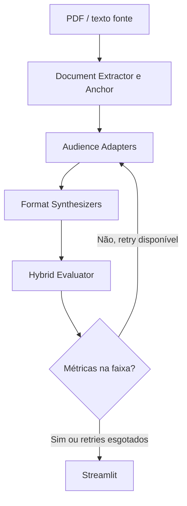

"""Suno Content

Pipeline de IA para adaptar documentos financeiros públicos (atas do Copom, fatos relevantes, releases) a três públicos e três formatos, com uma suíte de avaliação determinística no centro do sistema.

## Sumário

- [Visão geral](#visão-geral)
- [Matriz de adaptação](#matriz-de-adaptação)
- [Arquitetura](#arquitetura)
- [Stack](#stack)
- [Como rodar](#como-rodar)
- [Estrutura](#estrutura)
- [Entregáveis](#entregáveis)

## Visão geral

Resumir ata do Copom com um LLM genérico costuma falhar de dois jeitos: o modelo só encurta o texto, ou um segundo modelo “nota” o resumo com viés de complacência. Este projeto trata a adaptação como um grafo com estado e um contrato de métricas:

- extração de âncoras factuais do documento fonte
- adapters por persona (iniciante, intermediário, avançado)
- sintetizadores de formato (artigo, carrossel, roteiro de até 60s)
- avaliador híbrido (Flesch em português + densidade de termos + checagem de jargão)
- reflection loop: se a versão sai da faixa da persona, o grafo reprocessa com o relatório de falhas

O PDF do case está em `tap_case_suno.pdf`. TAP em `docs/referencias/tap.md`. Stack em `docs/referencias/premissas-stack.md`.

## Matriz de adaptação

| Audiência | Contrato |
| --- | --- |
| Iniciante | Zero jargão sem analogia cotidiana; impacto no bolso |
| Intermediário | Vocabulário de mercado (CDI, Selic, IPCA, dividendos); alocação e tendências |
| Avançado | Jargão pleno (curva de juros, forward guidance, hiato do produto, EBITDA ajustado, covenants) |

Formatos: texto analítico, estrutura de carrossel, roteiro de vídeo curto.

## Arquitetura



## Stack

Premissas em `docs/referencias/premissas-stack.md`.

- Python 3.11+
- LangGraph (esteira com retry)
- OpenRouter (gerar texto; DeepSeek V4 Flash, pago barato)
- Pydantic + Pydantic Evals (contrato e experimentos)
- pytest + Flesch/glossário (juiz determinístico)
- Jev / TypeSafe (no escopo: decisões tipadas no avaliador)
- pypdf + Scrapling + trafilatura (PDF, HTML e URL no Streamlit)
- Streamlit (dashboard)

## Como rodar

```bash
python -m venv .venv
.venv\\Scripts\\activate
pip install -e ".[dev]"
copy .env.example .env
pytest
streamlit run src/ui/app.py
```

A interface aceita PDF/texto ou a amostra em `data/samples/copom_sintetico.txt`.

## Estrutura

```
src/extract/     extração de texto e âncoras
src/adapters/    personas (iniciante / intermediário / avançado)
src/formats/     artigo, carrossel, roteiro
src/eval/        Flesch-PT, densidade de termos, score híbrido
src/glossary/    glossário financeiro e analogias
src/graph/       estado, roteamento e pipeline LangGraph
src/ui/          dashboard Streamlit
tests/           asserções determinísticas da suíte de eval
docs/referencias/tap.md e premissas-stack.md
```

## Entregáveis

1. Pipeline estruturada + GitHub com contribuições consistentes
2. Suíte de avaliação híbrida
3. Reflection loop
4. Interface de demonstração
5. Vídeo de 5–7 min (critério eliminatório)
6. Relatório experimental no README
